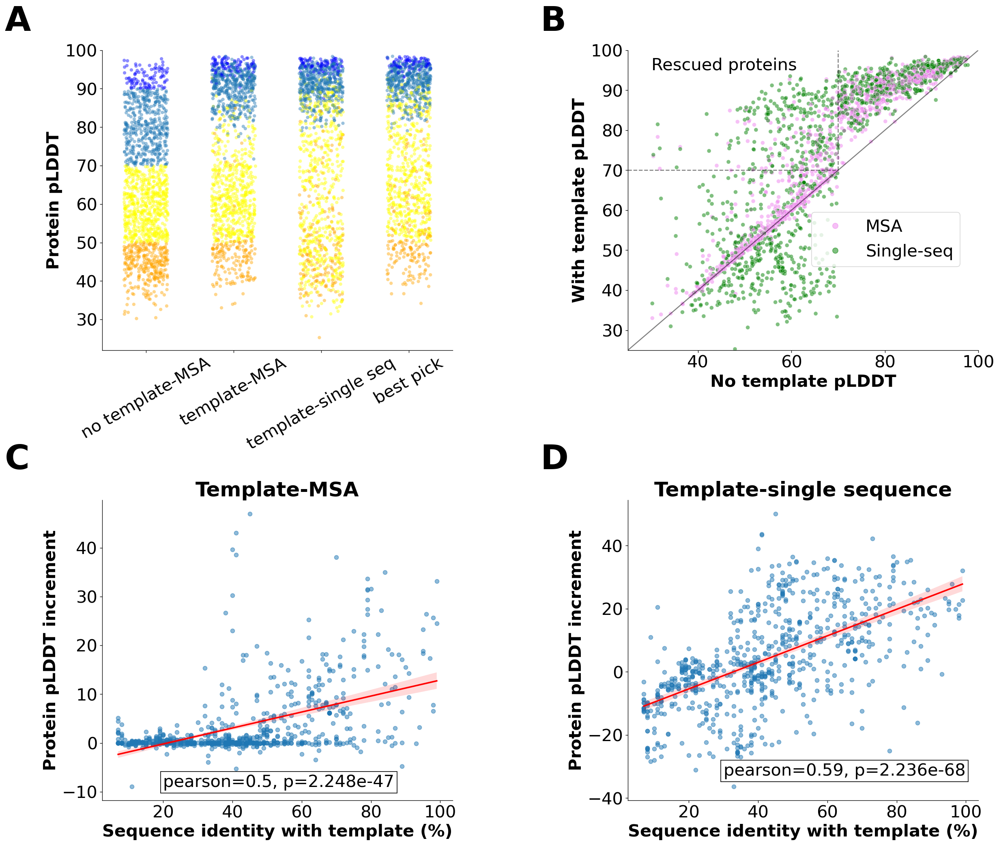

# Code of "Keeping it in the family: Using protein family templates to rescue low confidence AlphaFold2 models" paper

## Data:
- [Table with domains showing plDDT bimodal distributions](data/domains_bimodal_distribution.xlsx)
- [Comparison with AF3](data/AF3)
- Other data are available at: [https://zenodo.org/records/13960775](https://zenodo.org/records/13960775)

## Graphical diagram



## Dependencies

The pipeline is designed to run on an high perfromance computing cluster through [SLURM](https://slurm.schedmd.com/documentation.html) via [NEXTFLOW](https://www.nextflow.io/) (version 23.04.1).

### ColabFold database
Download ColabFold databases as explained [here](https://github.com/sokrypton/ColabFold) and place them in [assets](assets/)

### PfamxAlphaFold
The alphafold-pfam database should be created using [these instructions](https://github.com/matthiasblum/pfam-alphafold) and placed in [assets](assets/). 

### Pfam
The Pfam 35 [MySQL](https://www.mysql.com/) database can be downloaded [here](https://ftp.ebi.ac.uk/pub/databases/Pfam/releases/Pfam35.0/) and and each file of the database imported as follows:
```
zcat file.sql.gz | mysql -u <user> -p pfam_35
```
Once the pfam database has been created, pass the hostname in "prams.pfamhost", the username in "params.pfamuser",  the password in "params.pfampassword" and the port in "params.pfamport" for the database in the [pipeline.nf](./pipeline.nf) file header.

### Change script permissions

Allow execution of scripts by nextflow with:
```
chmod +x bin/*
```

## Run the pipeline

To reproduce the results obtained in the paper, run the following:

```
sbatch < scripts/run.sh
```

To run the pipeline on a customised set of proteins, use [this script](scripts/run_custom_proteins.sh) as example. Note that you will need to specify the proteins and the domain to be used for each protein.

## Other scripts 

The scripts contained in [scripts](scripts/) were also adopted:

- estimate_co2.sh was used to estimate the amount of CO2 produced with the computation;
- get_distribution.py was used to extract the whole plDDT pfam distributions;
- get_domain_info.sh was used to extract the information about domains considered in the paper;
- seed_AF2.py was used to run AF2 with multiple seeds;

The [images](images) can be reproduced using [this notebook](generate_figures.ipynb) after downloading the results folder from [here](https://drive.google.com/file/d/1kwVIoCmdlwoiTmVcZTmeGr6ymd4xEy4g/view?usp=drive_link) and uncompressing it.

The workflow image was obtained with [draw.io](https://www.drawio.com/).
Dependencies needed for image generation: python 3.8, seaborn (version 12.2), pandas (version 1.5.3), matplotlib (version 3.6.2), numpy (version 1.24.3), Biopython (version 1.81), scikit-learn (version 1.2.2), 


[The diagram](figures/figure2.png) was generated with https://app.diagrams.net
